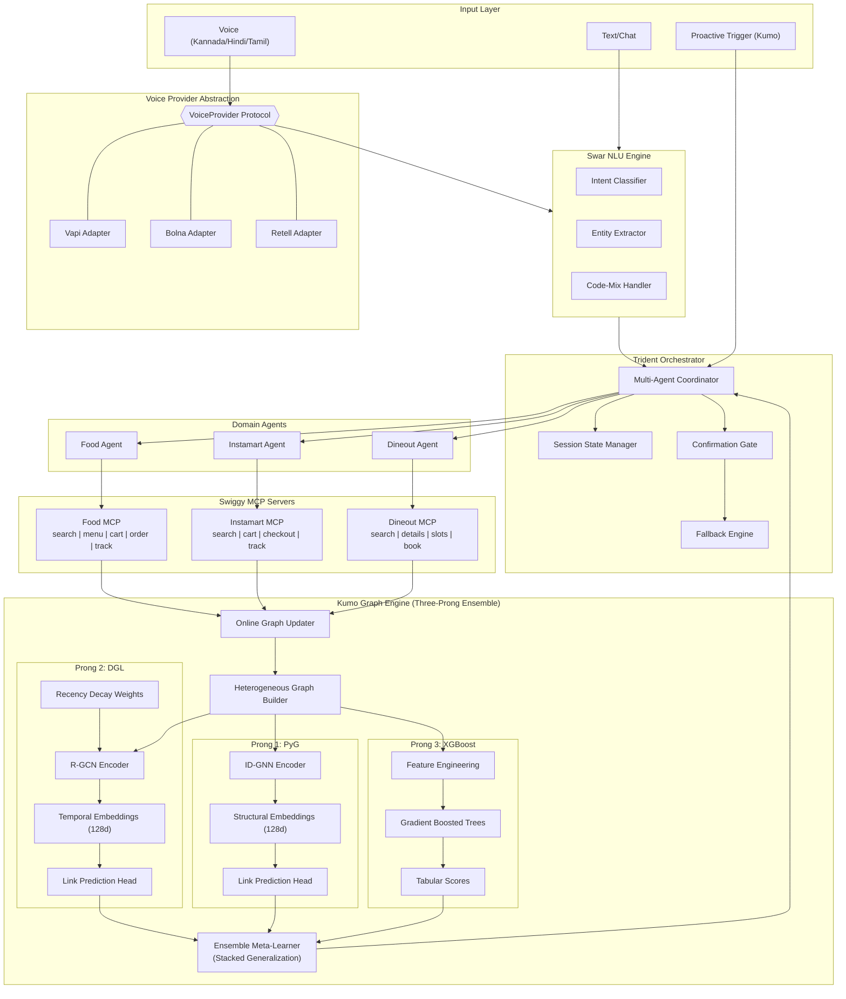
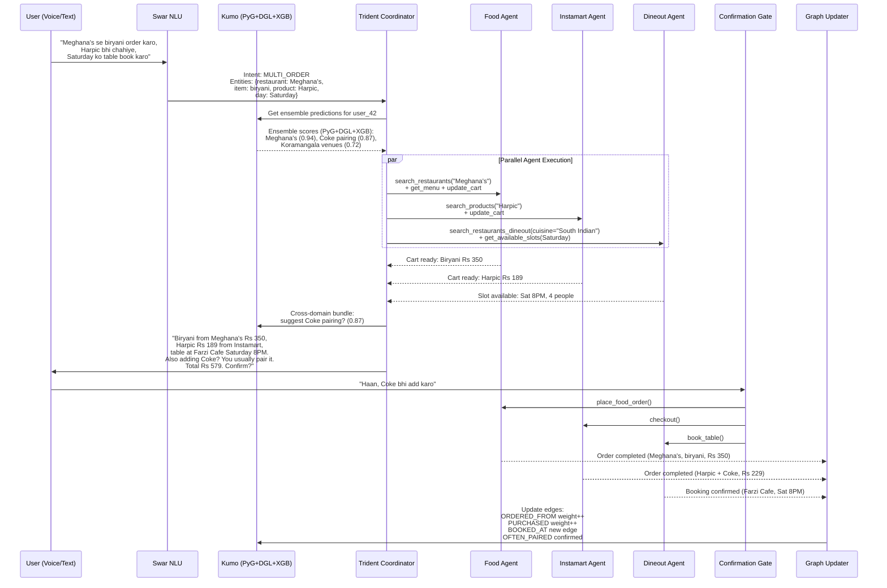
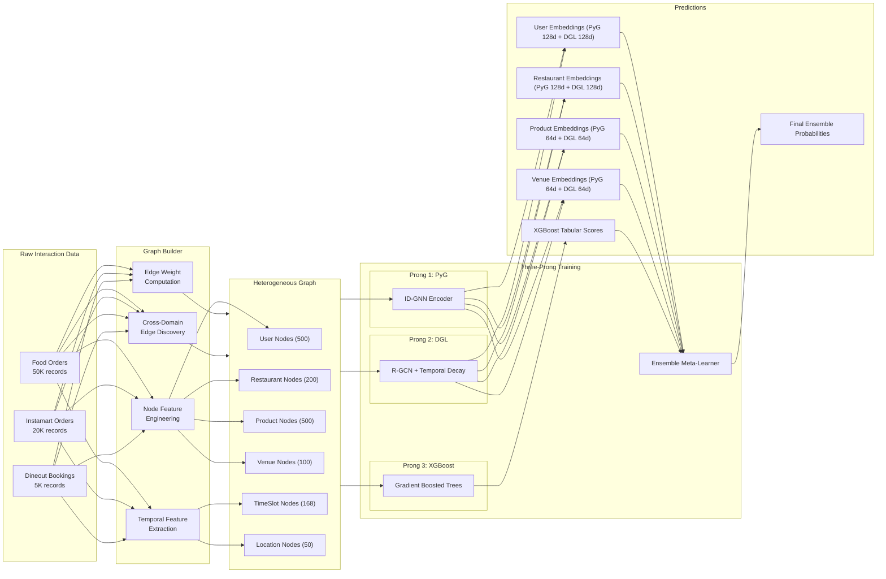
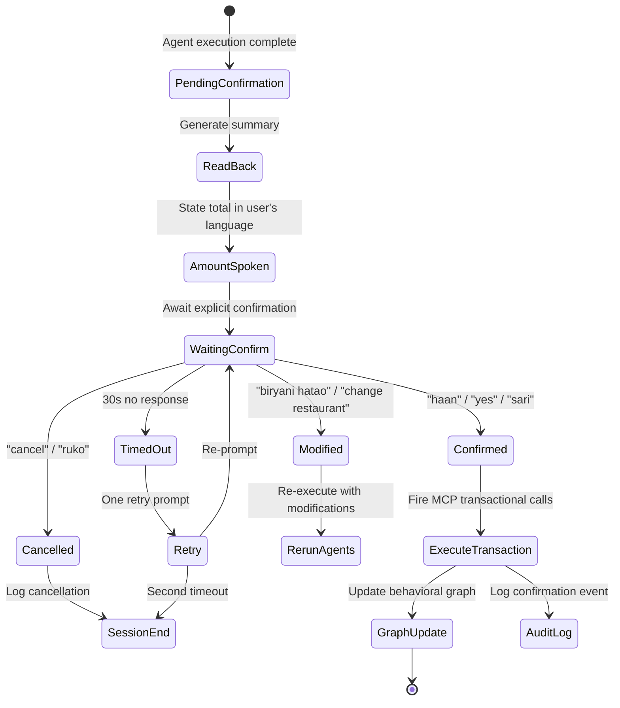
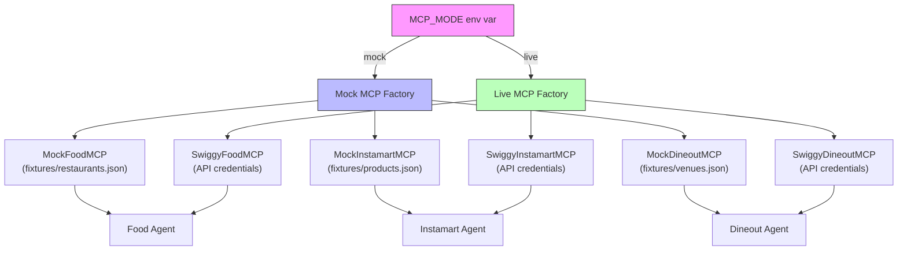

# BGI Trident - System Architecture

## High-Level Flow

## Predict-Decide-Execute-Learn Loop

## Graph Construction Pipeline

## Confirmation Gate (Fraud/Risk Pattern)

## Mock-to-Live MCP Swap

